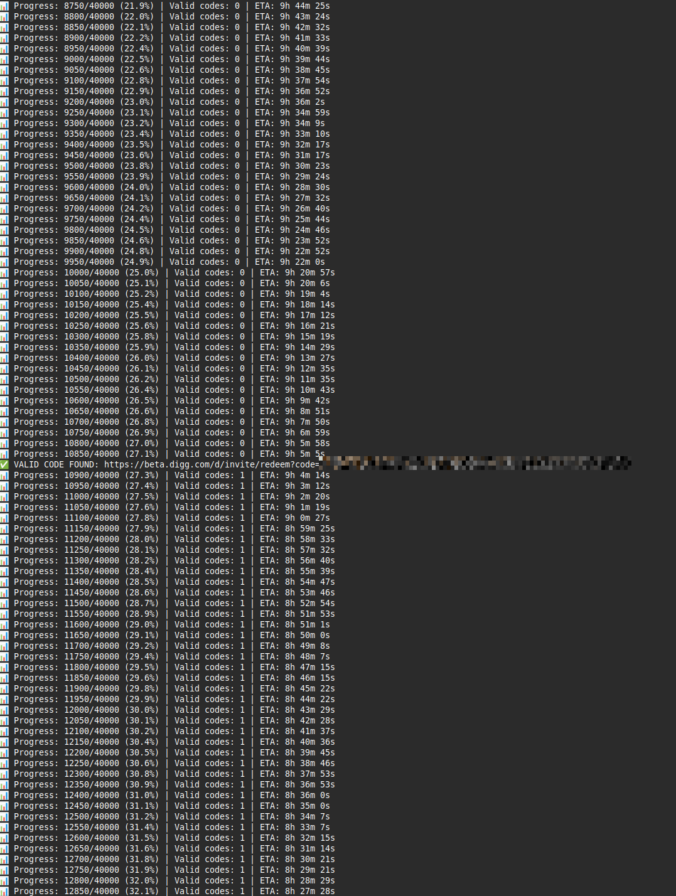

# Digg Invite Code Brute Force

Brute force testing of beta.digg.com invite codes using Selenium with multi-threading.

## Setup & Run

```bash
pip install -r requirements.txt
python digg_invite_bruteforce.py
```

Choose 1-8 Chrome windows for parallel processing. Valid codes saved to `results/`.

## Status

**🎉 SUCCESS!** After running for a day or two, we finally got one invite code working!



**Good luck to you all running this!** If you have insights into Digg's invite code generation pattern, PRs welcome.

Tested: 6-character lowercase combinations (a-z). 
Current approach: Sequential brute force with 0.1s delay between requests.
